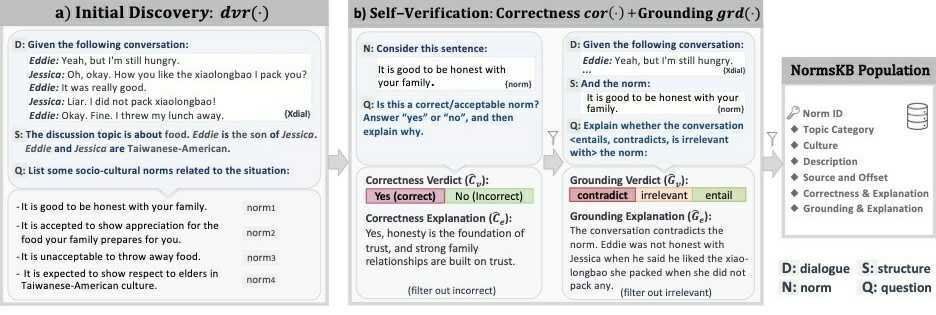

# NormSage

This is the repo of **NormSage: Multi-Lingual Multi-Cultural Norm Discovery from Conversations On-the-Fly** [[paper]](https://aclanthology.org/2023.emnlp-main.941.pdf)

### Project Description
Socio-cultural norm understanding is important for situation awareness and interaction effectiveness. Previous work such as **SocialChem101** ([Forbes et al., EMNLP'20](https://arxiv.org/pdf/2011.00620.pdf)) only performed automated norm generation from highly curated/abstracted situations i.e., Reddit/AmItheAssholepost titles. Our work directly discover normsfrom bottom-up human dialogue interactions combined with top-down commonsense knowledge, and incorporate explanations for chained reasoning & _transparency_.



### Code Structure
```
NormSage
│   README.md
│   configs/   
└───data
│   │--dialchunk/
│   │--dialraw/
│   │--MTurk/
│   │--norm_discoveries/
│      │--NormSage_base.json
│      │--NormSage_wSchema.json
│      │--NormSage_wIndc.json
│      │--NormsKB.json
│   
└───main/
    │   1_cut_dialogues.py  
    │   2_prompt_indictors.py  
    │   3_prompt_norms.py  
    │   4_NormsKB_population_new.py 
    │   5_main/eval_correctness_performance.py 
    │   6_MTurk_intrinsic_eval.py  
    │   7_prompt_grounding.py
    │   8_proc_grounding.py
    │   9_prep_MTurk_grounding_expl.py
    │   10_MTurk_prep_ground_expl_comparison.py
    │   11_MTurk_grounding_expl_eval.py
    │   utils.py

```

### Norm Discovery

**Baselines**
```
# SocialChem101-gen
conda activate SocialChem10 && cd ../baselines/SocialChem101 && \
python -m sc.examples.generate_yi --model output/gpt2-xl_rot_64_5epochs

# SocialChem-rtv
python baselines/SocialChem101/script_retr_SocialChem_ROT.py

# MIC-gen
conda activate moral && cd ../baselines/MIC/mic && \
python rot_generate_yi.py

# MIC-rtv
conda activate morals && \
python baselines/MIC/script_retr_MIC_ROT.py

# TOpp
conda activate T0 && \
python baselines/T0/main_norm_discovery.py

# GPT3 (i.e., NormSage-dvr, without correctness & grounding self-verification)
python main/3_GPT3_results.py

# NormSage_mini (NormSage using a local, finetuned LM instead of GPT3 backbone)
python main/3_prompt_norms_local.py --mode test
```

**NormSage**
```
python main/3_prompt_norms.py  
python main/4_NormsKB_population_new.py
```

**Data Comparison Scripts**
```
python data/human_assessment/norm_discovery_comparison.py
python data/human_assessment/scripts_compare_multiLing.py
python data/human_assessment/scripts_compare_culture_specific.py
```

### [Norm Correctness](https://uofi.box.com/s/u2s3vpzavarr5uxneumcm8pczmg7sh3h)
**Baselines**
```
python baselines/SocialChem101/SocialChem_agreeability_scorer.py
python baselines/NormSage_mini/correctness.py
python baselines/T0/main_correctness.py
```

**NormSage-corr**
```
python main/5_eval_correctness_performance.py
```

### [Norm Grounding](https://uofi.box.com/s/kben635i89du6z68in1g9zkylhuc585d)
**Baselines**
```
python baselines/MNLI/eval.py
python baselines/eDialNLI/eval.py
python baselines/T0/main_grounding.py
python baselines/T5-eSNLI/main_grounding.py
```

**NormSage-grd**
```
python baselines/NormSage_mini/grounding.py && python baselines/NormSage_mini/grounding_eval.py
python main/7_prompt_grounding.py
```

### Output Result Data Structure
```
{"fname_XX":
    {"norm_discoveries":[,
        {"norm_description":"",
         "Q":"",
         "Correctness":(contradiction_score, neutral_sccore, ent_score, expl),
         "Grounding":(contradiction_score, neutral_sccore, ent_score, expl)
        },
     ...], 
     "dial":""
    },
 "fname_YY":{
 ...
 }
}
```

